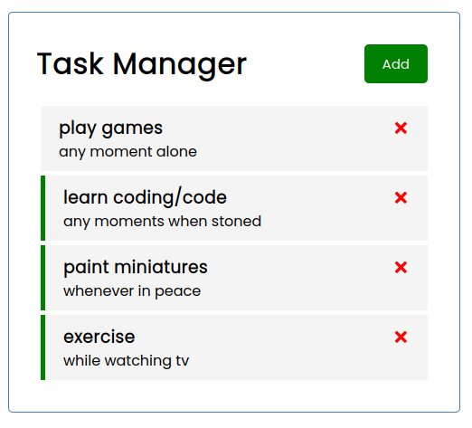

# React To Do list
>Another litle exercise to freshen up my understandig of newest react trends and features

### Technologies

* json-server - 0.16.3 
* react - 17.0.1
* serve - 11.3.2

###### [serverless live example](https://grzesiekkozdroj.github.io/react-exercises-2021/)

### Setup
To install on yout machine you may need to run following commands:  
`npm init`  
to install mock up server run:  
`sudo npm i -g serve` 
to run mock up server open terminal and run: 
`serve -s public -p 8000` 
make sure homepage in file package.json is set up to `/` if its not, change it. 
for mockup json server install `npm i json-server` 
then in new terminal run command 
`npm start` to open live example on your machine 

### Features
* Allows to write mock to do list with unformatted date (can write anything really)
* Allows to delete items from the list 
* By double clicking updates reminder (with no further consequences other than change in styling)
* Not on github pages, but if installed locally, list persist over the page refreshing

### To do list:
* add routing that works while in github enviroment

### Credits
In this exercise I have been following [youtube](https://www.youtube.com/watch?v=w7ejDZ8SWv8) tutorial made by Traversy Media

